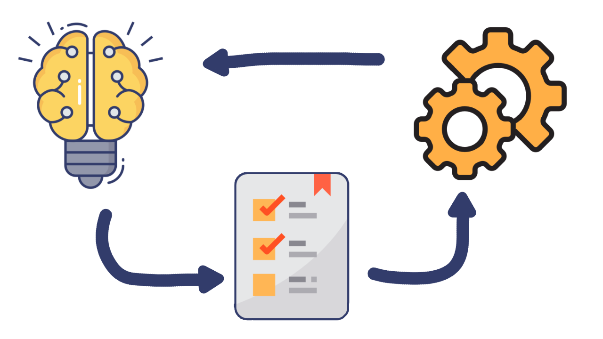

# Task Manager Application

The Task Manager Application is a web-based task management solution designed to help users stay organized and manage their tasks efficiently. This application provides a user-friendly interface for creating, editing, and organizing tasks, making it easier for individuals and teams to track their work and boost productivity.

## Key Goals

- Streamline task management for individuals and teams.
- Provide an intuitive and responsive user interface.
- Enable users to create, edit, delete, and categorize tasks.
- Implement user authentication for secure access to task lists.

## Features and Functionality

### User Registration and Authentication

- Securely create user accounts and log in.
- Protect user data and task lists with authentication.

### Task Management

- Create new tasks with titles, descriptions, due dates, and priorities.
- Edit existing tasks to update details.
- Mark tasks as completed.
- Delete tasks when no longer needed.

### Task Organization

- Filter tasks by due date, priority, or category.
- Search for specific tasks using keywords.
- Categorize tasks into custom categories.

### User-Friendly Interface

- Intuitive and responsive design for a seamless user experience.
- Real-time updates for task status changes.
- Interactive elements for easy task management.

## Technologies Used

- **Front-end:**
  - HTML
  - CSS
  - JavaScript

- **Back-end:**
  - Python
  - Flask (Web Framework)
  
- **Database:**
  - MySQL (Database Management System)

- **API:**
  - RESTful API built with Flask

- **Version Control:**
  - Git (Version Control System)
  - GitHub (Code Hosting and Collaboration)

## Screenshots or Demo

Screenshots and a live demo of the Task Manager Application will be provided in the near future as the project progresses.

## Roadmap and Future Enhancements

The project's roadmap includes the following future enhancements:

- User collaboration and shared task lists.
- Task categorization and tagging for improved organization.
- Notifications and reminders via email or push notifications.
- Integration with third-party productivity tools.
- Development of mobile apps for iOS and Android platforms.

## Contact Information

- **Name:** Your Name
- **Email:** abdo202224@gmail.com
- **GitHub:** [GitHub Profile](https://github.com/abdo-mhmd)
- **LinkedIn:** [LinkedIn Profile](https://www.linkedin.com/in/jingyi-su-33766b154)
- **Portfolio:** [Portfolio Website](https://www.abdomhmdportfolio.com)

## Getting Started

To get started with the Task Manager Application, follow these steps:

1. Clone this repository to your local machine.
2. Set up your development environment as described in the README.
3. Initialize the Flask app and configure it.
4. Create the necessary database `taskmanagerdb` and tables in MySQL.
5. Run the Flask app using `python run.py`.

Enjoy organizing your tasks and boosting your productivity with the Task Manager Application!

